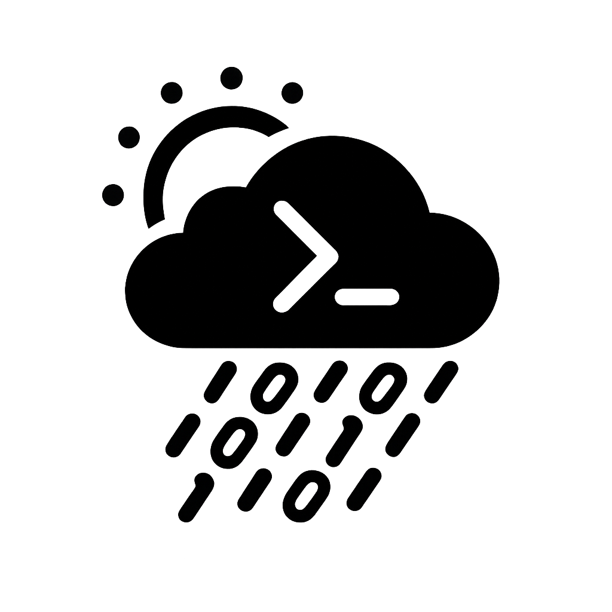

# termcast-weather

>Comprehensive system for generating real-time meteorological visualizations directly within a command-line interface. The output is rendered entirely in ASCII art, enabling universal accessibility across diverse terminal environments without dependence on graphical subsystems. Beyond basic temperature and condition reporting, the system incorporates advanced modules for dynamically updating visual representations of wind fields, precipitation patterns, thermal indices, barometric pressure variations, and air quality metrics. A radar-like ASCII overlay offers spatial context, while interactive navigation allows users to cycle through distinct atmospheric dimensions. By unifying textual weather data with symbolic visualization in an environment-agnostic medium, the project exemplifies the intersection of scientific data dissemination, minimalist interface design, and the aesthetic tradition of terminal-based information systems.

---
>[!TIP]
>>Run it with watch -n 300 (or your preferred interval) to keep the ASCII weather display updating automatically in real time.
